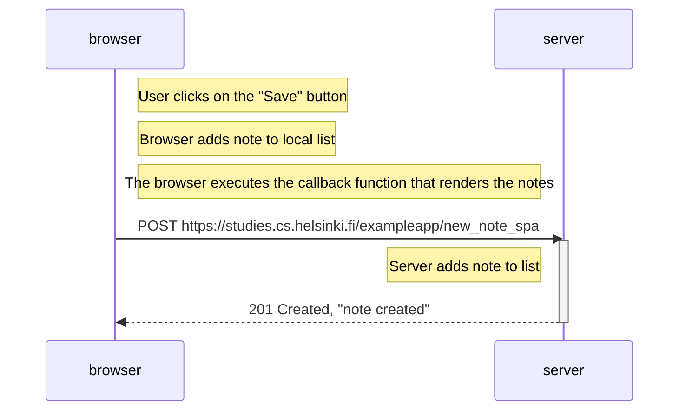

```mermaid
sequenceDiagram
    participant browser
    participant server

    Note right of browser: User clicks on the "Save" button
    Note right of browser: Browser adds note to local list
    Note right of browser: The browser executes the callback function that renders the notes
    browser->>server: POST https://studies.cs.helsinki.fi/exampleapp/new_note_spa
    activate server
    Note left of server: Server adds note to list
    server-->>browser: 201 Created, "note created"
    deactivate server
```
